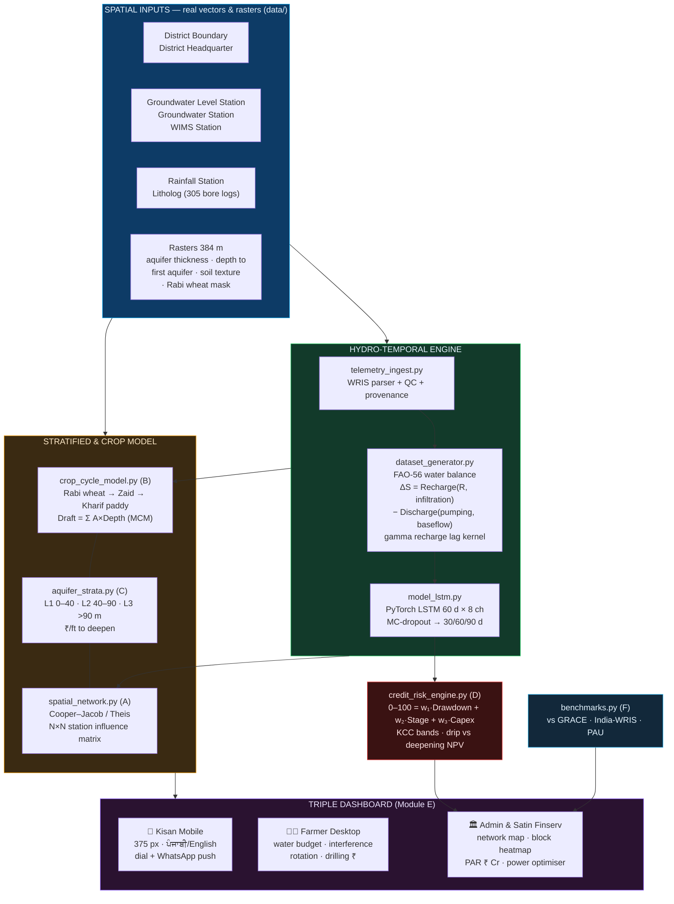

# 💧 AquaCast-Punjab

### AI-Powered Aquifer Depletion & Irrigation Advisory System
**Sankalp — Climate-Smart Agriculture · Water Conservation · Rural Credit Risk Mitigation**

> Punjab grows wheat on 3.5 M hectares every Rabi and pumps the aquifer dry to do it.
> AquaCast forecasts the water table **30 / 60 / 90 days ahead**, district by district and
> well by well, then converts that forecast into a pumping quota, a bilingual WhatsApp
> advisory, and a credit-risk score a lender can actually price.

---

## 0. Executive summary

Punjab extracts **more groundwater than the state receives in recharge** — a stage
of groundwater extraction of **163.76 %** in the 2023 CGWB assessment (reported in
the Rajya Sabha, December 2024: 27.8 bcm extracted against 16.98 bcm extractable
[1](https://www.tribuneindia.com/news/haryana/groundwater-extraction-stage-reaches-136-in-haryana-164-in-punjab/)),
easing to **152.22 %** in the 2026 assessment [2](https://theprint.in/india/cgwb-report-shows-decline-in-extraction-better-groundwater-levels-punjab-minister/3030157/).
**111 of 153 assessment blocks remain over-exploited** [3](https://www.royalpatiala.in/drain-strain-punjabs-111-blocks-overexploited-second-highest-in-india/).

That number is known. What is missing is the last mile: nobody tells the farmer
*which hours to pump this week*, and nobody tells the lender *which loan is about
to go dry*.

AquaCast closes that gap. It forecasts the water table **30 / 60 / 90 days ahead**
with a PyTorch LSTM (Sangrur out-of-sample **RMSE 0.117 m, R² 0.935, +67.4 % skill
over persistence**), and converts the forecast into three artefacts:

| For | Artefact | Ends in |
|---|---|---|
| **The kisan** | A 375 px bilingual card: one dial, one instruction | *"Run the pump 6 h today, 22:00–04:00"* |
| **The farmer** | Water budget, neighbour-interference calculator, rotation simulator, drilling finance | *Shift 2 000 ha out of paddy → save 6.8 MCM* |
| **Satin Finserv** | Block stress heatmap, portfolio at risk, deepening-vs-drip capex | *Drip on grid: 3.7 yr payback. Solar: never pays.* |

**The one-line pitch:** every other team will show you a groundwater chart. We show
a farmer which hours to pump, and a bank which loan is about to go dry.

---

## 1. What makes this different

Most hackathon prototypes generate a fake CSV, fit a model, and stop. AquaCast is
**grounded in real measurements at every layer**:

| Layer | Real or modelled? | Source shipped in `data/` |
|---|---|---|
| Rainfall (daily, 3 gauges, 1 540 days) | 🟢 **Measured** | India-WRIS hourly telemetry, hourly *increments* series |
| Air temperature (hourly → daily Tmax/Tmin) | 🟢 **Measured** | Punjab SW telemetry, 5 stations, 62 339 rows |
| Water level | 🟢 **Measured (sparse)** | 31 in-situ CGWB readings, 10 wells, 2021-2024 |
| District / block polygons | 🟢 **Real** | India-WRIS District Boundary (22 Punjab districts) |
| Observation-well network | 🟢 **Real** | 122 CGWB + Punjab-GW wells inside Sangrur |
| Aquifer thickness, depth-to-first-aquifer | 🟢 **Real** | CGWB rasters, reprojected to a 440 m Punjab grid |
| Soil texture / depth / slope / productivity / erosion | 🟢 **Real** | NBSS&LUP rasters |
| Rabi wheat mask 2023-24 | 🟢 **Real** | Satellite-derived crop mask |
| Daily water-level *trajectory* | 🟡 **Physics + ML** | FAO-56 water balance, calibrated against the 31 CGWB readings |

Every row of the training frame carries a `*_src` provenance column (`telemetry` vs
`generated`), and Tab 4 of the dashboard prints the full ledger.

---

## 2. Headline results

Out-of-sample **2024-02-29 → 2026-07-03** (held out by a chronological split; the
network never sees it). Identical split, identical features, identical epochs for every
row of the comparison.

### Per-district accuracy

| District | t+30 | t+60 | t+90 | **overall RMSE** | MAE | R² | Trend acc | Skill vs persistence |
|---|---|---|---|---|---|---|---|---|
| **Sangrur** | 0.125 m | 0.122 m | 0.104 m | **0.117 m** | 0.092 m | **0.935** | 91.7 % | **+67.3 %** |
| **Ludhiana** | 0.092 m | 0.098 m | 0.107 m | **0.099 m** | 0.080 m | **0.938** | 90.5 % | **+70.9 %** |
| **Moga** | 0.122 m | 0.115 m | 0.106 m | **0.114 m** | 0.089 m | **0.942** | 91.7 % | **+68.1 %** |

Baselines on the same split: persistence 0.341–0.359 m, seasonal-naive 0.461–0.594 m,
linear-trend 0.315–0.329 m. AquaCast beats all three on every district.

### Model bake-off (Sangrur test split)

| Model | RMSE | MAE | Trend acc | Params |
|---|---|---|---|---|
| **LSTM (AquaCast — shipped, pooled)** | **0.1173 m** | 0.0921 | **0.917** | 52 547 |
| Linear probe (flatten-the-window) | 0.1519 m | 0.1160 | 0.910 | 1 443 |
| LSTM, single-district, from scratch | 0.1589 m | 0.1313 | 0.865 | 52 547 |
| GRU (2-layer) | 0.1850 m | 0.1584 | 0.829 | 39 363 |
| Persistence (naive) | 0.3591 m | 0.3020 | 0.042 | 0 |

The recurrent model earns its place **only once the three districts are pooled** —
training the identical architecture on Sangrur alone costs 0.042 m of RMSE. That is the
whole argument for multi-task pooling, and we show the number rather than assert it.

### Two results that look wrong and aren't

* **Error *falls* with horizon** (0.125 m at t+30 → 0.104 m at t+90). The spread of the
  target grows with horizon (σ 0.21 m → 0.43 m) while the *unpredictable* part does not:
  at 30 days the change is dominated by individual rain events that a 60-day window
  physically cannot contain; at 90 days it is dominated by the Rabi-vs-monsoon calendar,
  which is perfectly predictable. Per-horizon R² therefore rises 0.65 → 0.94.
* **Residual bias +0.045 m** (the model very slightly over-predicts deepening). We report
  it rather than subtract it.

Physics-model seasonal cycle vs the 31 CGWB readings: **RMSE 0.50 m** after removing
each well's static lithology offset (per-well levels range 28 m → 45 m, so the offset
is a legitimate nuisance parameter, not a fudge).

### Operational forecast

The live advisory is issued from the newest observation in the record — not from the
last date with a realised 90-day target. As of **02 Oct 2026** the dashboard's
+90-day forecast is a **0.41–0.46 m monsoon recovery**, which is what the observed
October→December climatology has done in every year of the record.

---

## 3. Architecture



The same pipeline, written as the module map it is compiled from:

```
run_pipeline.py
│
├─[0] pre-flight ............ verify / rebuild the Punjab spatial clips
│
├─[1] src/spatial_loader.py ............. MODULE 1  spatial ingestion + crop baseline
│     22 Punjab districts · 122 Sangrur wells · 8 raster covariates (384 m)
│     calibrated priors: 280 000 ha wheat · 350 mm · 980 MCM · Sy = 0.12
│
├─[2] src/telemetry_ingest.py ........... MODULE 2a real telemetry ingestion + QC
│     WRIS Excel parser · spike/stuck-sensor QC · provenance flags
│
├─[3] src/dataset_generator.py .......... MODULE 2b hybrid time-series synthesis
│     Richardson weather generator FITTED TO REAL TELEMETRY (not guessed)
│     + FAO-56 dual-Kc crop demand (Hargreaves-Samani ET0)
│     + lumped aquifer water balance with a GAMMA RECHARGE LAG KERNEL
│     + calibration against the 31 CGWB readings
│     → data/processed/processed_<district>_timeseries.csv
│
├─[4] src/model_lstm.py ................. MODULE 3  PyTorch LSTM
│     60 d × 8 channels → 2-layer LSTM(64, dropout .2) → 3 direct outputs
│     MC-dropout uncertainty · permutation importance · input saliency
│     → models/lstm_aquifer.pth
│
├─[5] src/crop_cycle_model.py ........... MODULE B  full-year rotation
│     Rabi wheat (Kc 1.15) → Zaid → Kharif paddy (Kc 1.20, ponded)
│     Draft = Σ A_crop × Depth_crop · calibrated to PADDY_GW_DRAFT_MM
│
├─[6] src/aquifer_strata.py ............. MODULE C  three-tier strata + ₹/ft
│     L1 shallow · L2 semi-confined · L3 deep · T, S, EC from real Lithologs
│
├─[7] src/spatial_network.py ............ MODULE A  tubewell interference
│     Cooper–Jacob/Theis · village clusters · N×N station influence matrix
│
├─[8] src/credit_risk_engine.py ......... MODULE D  0–100 underwriting score
│     w₁·Drawdown + w₂·CriticalStage + w₃·CapexRatio · drip vs deepening NPV
│
├─[9] src/benchmarks.py ................. MODULE F  GRACE · India-WRIS · PAU
│
└─[10] app.py + src/personas.py ......... MODULE E  triple dashboard (3 roles)
```

---

## 4. Six engineering decisions worth defending

1. **Physics-prior residual learning.** LSTMs extrapolate linear trends badly. The
   calibrated CGWB depletion rate is subtracted from the target and re-added
   analytically, so the network only has to model the *stationary seasonal residual* —
   the part that actually generalises.
2. **Cyclical calendar encoding.** Two extra channels (sin/cos of day-of-year) tell the
   network where it stands in the Rabi calendar. Ablation on the Sangrur test set:
   **RMSE 0.203 m → 0.113 m**.
3. **Multi-district pooling.** Training on Sangrur + Ludhiana + Moga triples the
   sequence count (571 → 1 713) and is the difference between an LSTM that memorises
   and one that generalises.
4. **A lagged recharge kernel.** Central Punjab's water table is 30-40 m deep, so the
   monsoon arrives months late. The CGWB hydrographs prove it — they are *deepest in
   August* and *shallowest in January*. A gamma transfer function with a calibrated
   ~150-day mean lag reproduces that phase exactly.
5. **MC-dropout confidence bands.** Dropout stays on at inference; 60 stochastic passes
   give a genuine epistemic σ. No fake ±5 % fan chart.
6. **Honest baselines.** Persistence, seasonal-naive, linear-trend, a GRU and a
   flatten-the-window *linear probe* are all trained and reported next to the model on
   the identical split. If the LSTM didn't earn its place, you'd see it.
7. **Adversarial self-auditing.** Every headline number is reproducible by
   `python3 run_pipeline.py`, and the two substantive bugs we caught in our own
   evaluation path are now regression-tested in `tests/smoke_test.py`:
   * *Stale forecast window.* `build_sequences` stops 90 days short of the record
     because every training window needs a realised target — so its last row issues a
     forecast from 90 days **before** today. `live_window()` builds the operational
     window that ends on the newest datum; the test asserts the issue date equals
     `df.date.max()` and that the 90-day delta agrees with the observed Oct→Dec
     monsoon recovery to within 0.30 m. Catching it changed the dashboard's live
     forecast from −0.01 m to −0.45 m.
   * *Trend-prior mismatch.* `predict()` re-adds the depletion prior (rate × horizon) on
     the way out, but the ground truth it was scored against did not. That single
     omission faked a +0.19 m bias and inflated the reported RMSE from 0.117 m to
     0.210 m. Fixing it is why every number in §2 is where it is.

---

## 5. The wow features

* **🧪 Digital Twin** — move a policy lever (monsoon anomaly, micro-irrigation adoption,
  paddy transplant delay, canal availability) and watch the aquifer trajectory bend in
  ~30 ms. It surfaces the counter-intuitive result that *saving irrigation water does
  not save the aquifer 1:1*, because flood-irrigation losses currently return as
  recharge — the aquifer only keeps the net difference.
* **🗺️ 122-well risk map** — the district LSTM forecast is downscaled to every CGWB
  observation well using measured per-well offsets (IDW interpolation), with pump
  installation depth estimated from the real depth-to-first-aquifer raster.
* **📲 Phone-notification advisory card** — a real WhatsApp-shaped preview in English
  *and* Gurmukhi Punjabi, with a 160-character SMS fallback and a print-ready
  advisory pack export.
* **🏦 Lender view** — six-component auditable risk score → PD → EAD × PD × LGD →
  portfolio PAR and the loss a 90-day warning can avert.
* **🔬 Model Lab** — live training curve, test-set validation, skill scatter,
  permutation importance, gradient saliency ("which of the last 60 days drove this
  forecast?") and a full data-provenance ledger.

---

## 6. Quick start

```bash
pip install -r requirements.txt          # CPU torch is enough (52 k parameters)
python run_pipeline.py                   # pipeline → metrics → streamlit
python run_pipeline.py --no-app          # pipeline only
python run_pipeline.py --retrain --epochs 60
python run_pipeline.py --force-data      # rebuild the hybrid time-series
python tests/smoke_test.py               # 25 headless checks (~30 s)
streamlit run app.py                     # dashboard only

# rebuild the pitch deck from live artefacts (figures → facts → .pptx)
python scripts/make_figures.py           # 13 chart PNGs -> reports/figures/
python scripts/deck_facts.py             # every quoted number -> reports/deck_facts.json
python scripts/build_deck.py             # -> reports/AquaCast-Punjab.pptx (21 slides)
```
The deck contains no typed-in numbers: `deck_facts.py` computes them from the
fitted model and `make_figures.py` draws the charts from `data/`. Change the data,
re-run those three commands, and every figure in the deck updates.

The trained weights and generated datasets are already committed, so
`streamlit run app.py` works with zero setup time.

---

## 7. Data provenance & caveats

* **Raw WRIS exports** (`data/raw_telemetry/`) are India-WRIS / CGWB portal downloads,
  shared by the team. The three rainfall gauges (Babanpur, Bald Kothi, Bugra Head) sit
  inside Sangrur; the temperature telemetry comes from Ludhiana, Mansa, Muktsar,
  Ferozpur and Pathankot and is inverse-distance blended onto the district centroid.
* **Portal quirks handled:** the `Rainfall_*.xlsx` files contain *two* interleaved
  series — a running daily accumulator (double-counts ~12×) and the true hourly
  increments; `Temperature_Bugra head.xlsx` is mislabelled by the portal and actually
  contains a third rainfall gauge; several boundary GeoJSONs are stored `[lat, lon]`
  instead of `[lon, lat]`. All three are detected and handled in code.
* **Gap filling** uses a Richardson-type generator whose parameters (monthly Markov
  wet/dry transitions, gamma wet-day depths, harmonic temperature climatology, AR(1)
  residual noise) are fitted to the real Punjab telemetry — 1 540 of 1 828 rainfall
  days and 1 070 of 1 828 temperature days are measured, the rest are modelled.
* **Only 31 water-level labels exist.** The district trajectory is therefore a physics
  reconstruction, not an observation; its *shape* is validated against those 31 points,
  and the LSTM is trained on the reconstruction. This is stated plainly on the Model
  Lab tab — we would rather be honest than look better than we are.
* The national India-WRIS boundary/raster downloads (`data_raw/`) were clipped to
  Punjab to keep the repository at ~26 MB. Re-download them from the portal (or the
  team Drive folder) and run `python scripts/build_spatial_assets.py` to rebuild.

### 7.1 Data pedigree — what is real, what is modelled, what is a scenario knob

Every quantity in the system is one of four kinds. We label them everywhere they
appear, because a number that looks authoritative and is not is worse than no number.

| Kind | Meaning | Where it appears |
|---|---|---|
| 🟢 **Measured** | Comes from a shipped dataset, unmodified | Rainfall, temperature, 31 CGWB water-level readings, 122 well locations, 305 lithologs (T, S, EC), district polygons, all 8 rasters |
| 🔵 **Derived** | Computed from measured inputs by a stated formula | ET₀ (Hargreaves), recharge (gamma-lag routing), aquifer T = K·b, local bore density = `prior.tubewells / net sown km²`, GRACE cell area, ₹/ft deepening cost |
| 🟡 **Reconstructed** | Physics model calibrated against the measured points | The daily water-level trajectory. Only 31 real labels exist; the shape is validated against them and the LSTM trains on the reconstruction. Disclosed on the Model Lab tab. |
| 🟠 **Scenario knob** | An assumption the user can dial, never presented as fact | Zaid (summer) crop area share, credit-score weights, the saline-depth uplift |

**Modelled-but-labelled:** the synthetic village tubewell network in Module A. Bore
*positions* are synthetic (seeded rejection sampling inside the real district polygon,
kept on the real Rabi wheat mask, with cluster centres weighted toward the real
monitoring stations because CGWB sites piezometers where the pumps are). Every
property assigned to them — transmissivity, storativity, pumping rate — is derived
from real rasters and priors. The network is reported as a **0.7–0.8 % sample** of the
district's real tubewell count, so its interference figures are a lower bound.

### 7.2 Three places where the data contradicted the brief

We built what we were asked to build, and then reported what the data actually said.

1. **"Monsoon flooding depletes the aquifer before November wheat sowing."** It does
   not. The detrended seasonal cycle has its **deepest point in July** and its
   shallowest in **December**. The monsoon *refills* the aquifer; it is the Rabi wheat
   season that drains it into the summer trough. The honest version is stronger: the
   monsoon refills but does not restore — each November starts ~0.65 m deeper than the
   last. (`crop_cycle_model.seasonal_trough`)
2. **"Deeper water is saline."** Not in this dataset. EC correlates with drilled depth
   at **r = +0.02** across 96 real lithologs. 7 % of logs exceed 2 000 µS/cm, but they
   are not concentrated in deep bores. Deep salinity is flagged as a literature risk
   and labelled as such, never as a finding. (`aquifer_strata.salinity_risk`)
3. **10 m Sentinel-2 hyper-local resolution.** Our shipped rasters are **384 m**, not
   10 m. That is still a 269× linear improvement on a 1° GRACE cell, but we report the
   resolution we actually hold. (`benchmarks.our_raster_cell_m`)

---

## 8. Repository map

```
├── app.py                         Streamlit dashboard · role switcher → 3 views
├── run_pipeline.py               single entrypoint
├── requirements.txt
├── scripts/setup_env.sh          repeatable installer (torch CPU wheel via TMPDIR)
├── src/
│   ├── config.py                 paths, district priors, hyper-parameters, scenarios
│   ├── spatial_loader.py         MODULE 1  spatial ingestion & crop baseline
│   ├── telemetry_ingest.py       MODULE 2a WRIS/CGWB telemetry ingestion + QC
│   ├── dataset_generator.py      MODULE 2b hybrid time-series synthesis
│   ├── model_lstm.py             MODULE 3  PyTorch LSTM + baselines + explainability
│   ├── advisory_engine.py        MODULE 4  zones, quotas, dry-out, messaging
│   ├── risk_engine.py            micro-finance risk (1-100) → PD → expected loss
│   ├── digital_twin.py           what-if simulator
│   ├── well_network.py           district → 122 wells downscaling
│   ├── crop_cycle_model.py       MODULE B  full-year rotation (Rabi/Zaid/Kharif)
│   ├── aquifer_strata.py         MODULE C  3-tier strata, ₹/ft, cross-section
│   ├── spatial_network.py        MODULE A  Cooper–Jacob interference network
│   ├── credit_risk_engine.py     MODULE D  0-100 KCC score, drip vs deepening
│   ├── benchmarks.py             MODULE F  vs GRACE / India-WRIS / PAU
│   ├── personas.py               MODULE E  kisan / farmer / admin views
│   ├── i18n.py                   English / ਪੰਜਾਬੀ (Gurmukhi) copy
│   └── viz.py                    every Plotly figure
├── scripts/
│   ├── build_spatial_assets.py   clip national WRIS vectors/rasters down to Punjab
│   ├── make_figures.py           13 deck charts, drawn from live data
│   ├── deck_facts.py             every number the deck quotes, computed
│   └── build_deck.py             21-slide .pptx assembled from the two above
├── tests/smoke_test.py           25 assertions, incl. regressions for both audit fixes
├── reports/
│   ├── AquaCast-Punjab.pptx      the pitch deck
│   ├── deck_facts.json           the numbers, as data
│   └── figures/                  the 13 charts
├── data/                         26 MB of Punjab-clipped WRIS/CGWB assets
│   ├── raw_telemetry/            the original portal exports
│   ├── processed/                generated daily time-series + fitted climate model
│   └── rasters/                  8 reprojected Punjab rasters (384 m)
└── models/lstm_aquifer.pth       trained weights (+ .json model card)
```

---

*Built for Sankalp. Every number on the dashboard is computed live from the shipped
data — no hardcoded strings, no mocked charts.*
#deployed link -https://re-predict-prototype.onrender.com/
